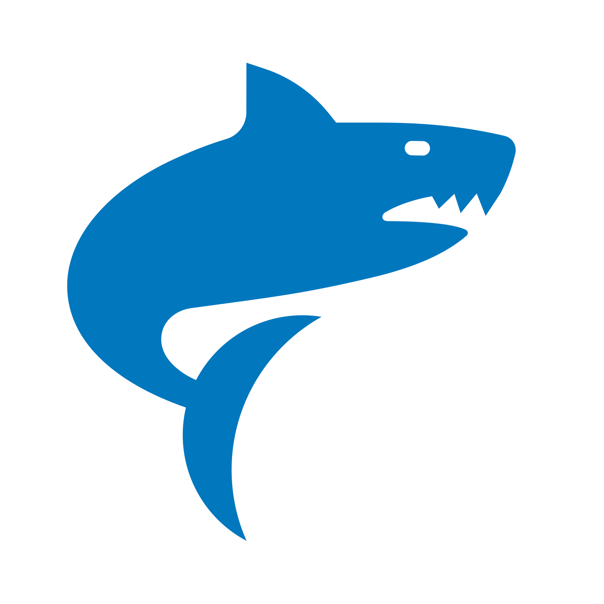

<div align="center" style="display:grid;place-items:center;">
<p>
    
</p>
<h1>The Shark Programming Language</h1>

<h4>Shark is a programming language with a language server, compiler and virtual machine</h4>
</div>

## About

Shark is written in Go aiming to be a simple, dynamically typed language with a focus on simplicity and ease of use. The language is compiled to bytecode that a virtual machine can run. It is inspired by languages like TypeScript and Dart.

## Key Features of SharkLang

- Dynamically typed
- Compiles to bytecode that a virtual machine can run
- Garbage collected
- VS Code extension for syntax highlighting
- Language server
- Caching

> [!NOTE]
> Shark is currently in development and there is no release yet.

## Example

```shark
let reduce = (arr, initial, f) => {
    let iter = (arr, result) => {
        if (len(arr) == 0) {
            result
        } else {
            iter( rest(arr), f(result, first(arr)) ) 
        }
    } iter(arr, initial)
};

let sum = (arr) => {
    reduce(arr, 0, (initial, el) => {
        initial + el
    })
};

let result = sum(1..5);

puts(result);
```